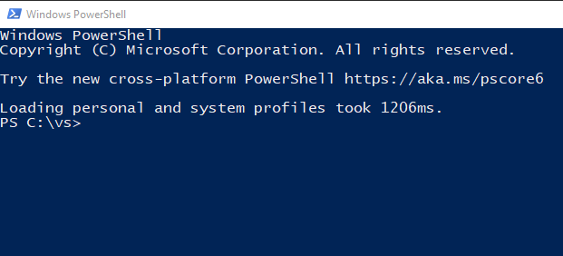
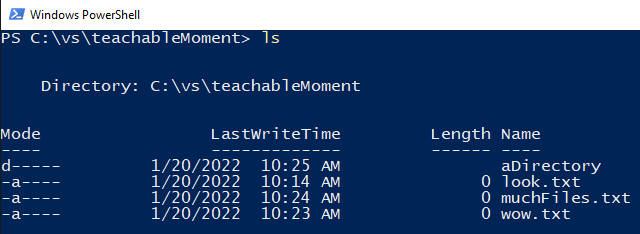
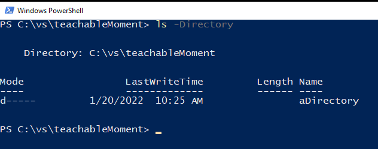
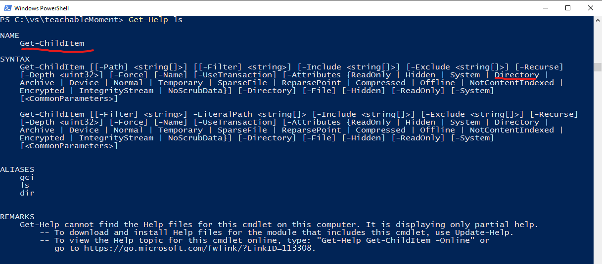

# PowerShell

Depicted above is a brand new PowerShell window.

You can open it in a few different ways

1. Hit (Win)+R
1. Type `powershell`
1. Hit enter

or

1. Hit (Win)
1. Type `powershell`
1. Click `Windows PowerShell`

Powershell is what’s known as a CLI (Command Line Interface). It is, quite literally, an interface in which you type lines of commands into one by one.

From the above screenshot, you can see that there is a header on the first 5 or so lines, followed by a line beginning with `PS C:\vs>`

To break it down, the `PS` means PowerShell, and the `C:\vs>` is the current directory you are in. My PowerShell begins in `C:\vs` due to my [PowerShell Profile](./PowerShell_Profile.md) set-up.

    I suggest reading through this first, if you are unexperienced with CLI’s.

# Commands

`"Anything you can do with your mouse and keyboard, you can 100% do faster with a CLI (most of the time)" - Me, Isam, just now, as I write this.`

Let’s start with an easy command. For instance ls lists out all the files in your directory.

(If `ls` does not work, try `dir`, or `Get-ChildItem`)

(If `ls` didn’t work, explanation is to come, hold tight)

As you can see, on the first line, I ran the `ls` command in this directory, and it listed out `everything` in the directory!

# Flags

But what if you want to only see directories and not files?

To pass options to a command is what is typically is known as `sending a flag to a command`

So, let’s pass an option to this command to only show `Directory`-s

To pass the flag, you must know the flag name, and prepend a `-` before it.

So in this instance, the command to list out all directories in our current location would be `ls -Directory`

And, as expected, we only see the directory, not the file.

# Other Commands

Make a directory? `mkdir` (otherwise try `New-Item`)

`mkdir teachableMoment`

Change directories? `cd` (otherwise try `Set-Location`)

Typically, a `.` means “where you currently are” and a `..` means, the parent folder, so…

to go up `cd ..`

to go inside a folder `cd ./aDirectory`

Delete a file? `rm` (otherwise try `Remove-Item`)

`rm muchFiles.txt`

`rm ./aDirectory`

(when deleting a directory, if it has files inside of it, you must pass in the `Recurse` flag, such as `rm ./aDirectory -Recurse`)

Play with these, see what you can understand from it, and move on to bigger and better commands over time!

# Finally…

After you have become bored of all the above commands…

What about other flags on those commands? (How do you think I figured them out?)

The `Get-Help` command can be used to find out how to use a command and what flags can be passed into it.

In the below case, I ran `Get-Help ls` (you may have to run `Get-Help Get-ChildItem`)

A little breadcrumb now…. Where do these commands live? How does Windows (or any OS :wink:​) know that when you say “ls" it should run the command (program!) to list out all the files in the directory you’re in????
